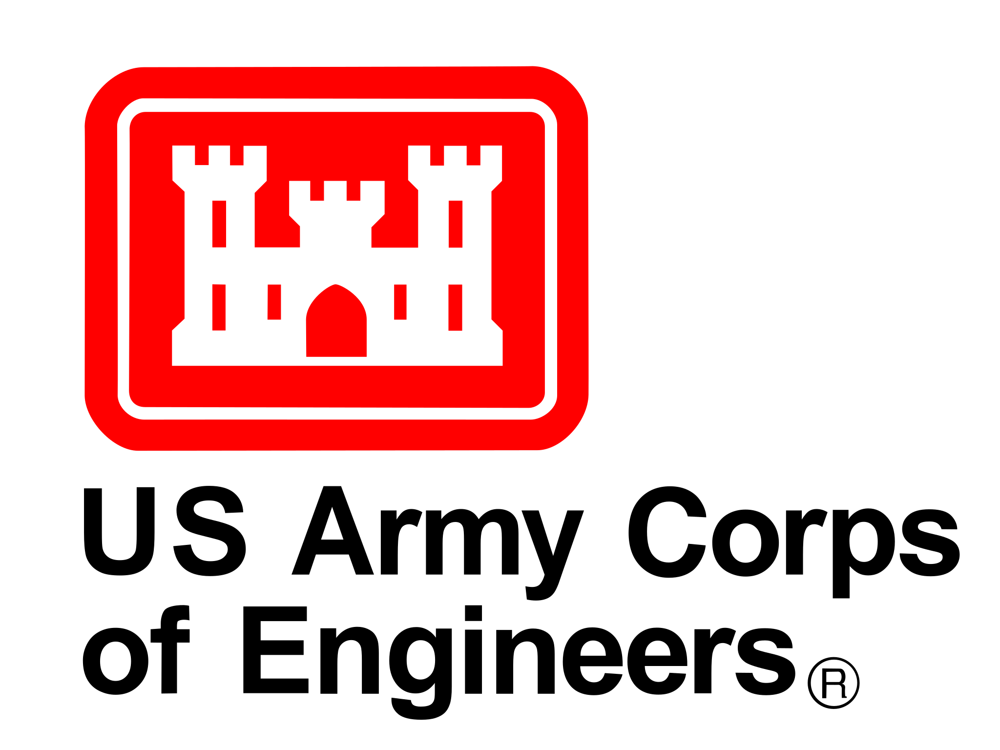
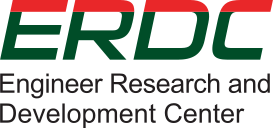
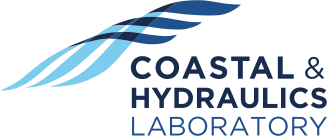

# ERDC Fluid-Structure Interaction R&D Workshop, April 14-15, 2016

Both the DoD and industry increasingly demand high-fidelity models of
Fluid-Structure Interaction (FSI). Examples include waves and currents
interacting with

- moored platforms and bridges,
- flood protection structures,
- granular materials (soil and sea ice), and
- autonomous vessels and vehicles.

**The overarching objective of this
  meeting is to promote technical exchange in a small group setting to support
  the development of new mechanistic theories and computational methods for
  coupled fluid-solid systems, with specific attention to critical concerns of
  the USACE and the DoD.**

# Agenda

## Thursday, April 14

Time | Topic | Presenter
-----|-------|----------
0800 | Opening Remarks | José Sánchez, Jane Smith, and Stacy Howington
0845 | [Chrono: An open-source physics engine](abstracts/Negrut.html) | Dan Negrut 
0930 | [Numerical modeling of wet particulate media in various limits](abstracts/Kamrin.html) |  Ken Kamrin 
1015 | Coffee Break |
1030 | [ERDC-GSL ground vehicles R&D](abstracts/Goodin.html) | Chris Goodin 
1050 | [ERDC-CRREL sea ice R&D](abstracts/Song.html) | Arnold Song 
1115 | [Space–time FSI computation: it’s worth it](abstracts/Tezduyar.html) | Tayfun Tezduyar 
1200 | Lunch |
1300 | [Multi-scale modeling of tsunami forces on coastal structures](abstracts/Motley.html) | Mike Motley 
1345 | [Adaptive unstructured approaches for problems with fluid-structure and multiphase interactions at extreme scale](abstracts/Sahni.html) | Onkar Sahni and Mark Shephard
1430 | Coffee Break |
1445 | [The shifted Nitsche method: a new approach to embedded/immersed boundary conditions](abstracts/Scovazzi.html) | Guglielmo Scovazzi
1530 | [Invariant domains preserving ALE approximation of hyperbolic systems with continuous finite elements](abstracts/Guermond.html) | Jean-Luc Guermond and Bojan Popov
1615 | [ERDC-CHL wave-vegetation interaction R&D](abstracts/Anderson.html) | Mary Anderson
1635 | [ERDC-EL fish and autonomous agent R&D](abstracts/Goodwin.html) | Andy Goodwin and David Smith
1700 | Closing |
1830 | Dinner at 10-South Rooftop Bar & Grill([Map](https://goo.gl/maps/wrdrkbT8gvC2)) |

## Friday, April 15

Time | Topic | Presenter
-----|-------|----------
0800 | Introduction to Proteus and basic tutorials | Chris Kees
0845 | Simulating waves: proteus.WaveTools and wave/structure tutorials | Aggelos Dimakopolous
0930 | Simulating structures: proteus.Geometry and floating structure tutorials | Tristan de Lataillade
1015 | Coffee Break |
1030 | Using the hashdist tool to manage HPC software distributions | Chris Kees
1045 | Using Proteus for fast prototyping and numerical methods research | Alistair Bentley
1100 | Proteus roadmap and discussion | Chris Kees 
1200 | Lunch |
1300 | Prioritization of FSI applications |
1345 | Identification of short-term technological gaps |
1430 | Coffee Break |
1445 | Indentification of long-term technological gaps |
1530 | Small group R&D project development |
1615 | Presentation of R&D project ideas |
1700 | Closing remarks |

## Location and Directions

*Conference Facility*, Coastal and Hydraulics Laboratory, US Army Engineer Research and Development Center, 3909 Halls Ferry Road, Vicksburg, MS 39180 ([Map](https://goo.gl/maps/5ZGQaCggdZk))

You will proceed through the front gate on Halls Ferry and continue down the hill past the red brick ACE-IT building, over the spillway, and to a four-way stop. Turn left at the four-way stop onto Delaware road and proceed up the hill and into the CHL parking lot on the left. Park in any spot labeled visitor  or any unlabeled spot. Check in and receive your badge in the CHL foyer.

## Point of Contact

Chris Kees <christopher.e.kees@usace.army.mil>

